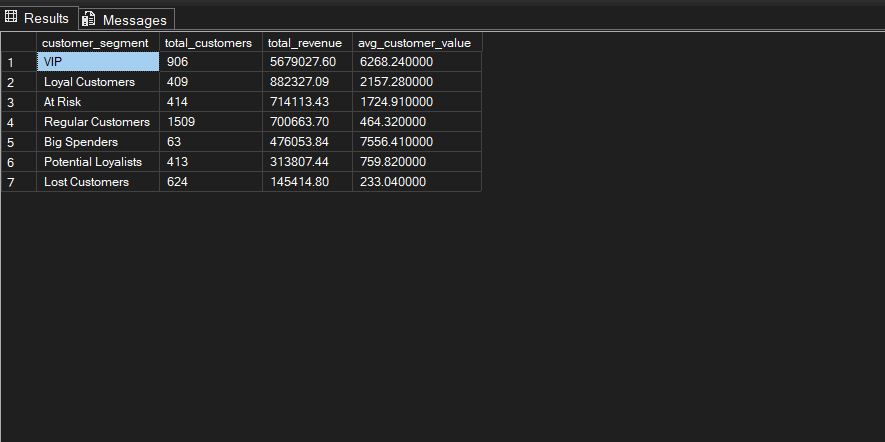

# Customer Segmentation (RFM Analysis)

## Overview

This project focuses on customer segmentation using RFM (Recency, Frequency, Monetary) analysis in SQL Server and Power BI.

The goal was to transform transactional data into customer-level insights and segment customers based on purchasing behavior.

---

## Business Objective

- Identify high-value customers
- Detect at-risk and lost customers
- Understand revenue contribution by segment
- Support targeted marketing strategies

---

## Dataset

- Source: Online Retail Dataset  
- Records: ~397,000 rows  
- Cleaned dataset used for analysis

---

## Approach

### 1. RFM Calculation
- Recency → Days since last purchase  
- Frequency → Number of orders  
- Monetary → Total spending  

### 2. RFM Scoring
- Used `NTILE(5)` to assign scores (1–5)
- Recency score reversed (lower days = higher score)

### 3. Segmentation
Customers grouped using business rules:

- VIP  
- Loyal Customers  
- Big Spenders  
- Potential Loyalists  
- At Risk  
- Lost Customers  
- Regular Customers  

---

## Power BI Dashboard

The dashboard provides:

- Total customers, revenue, and average value
- Customer distribution by segment
- Revenue contribution by segment
- Average value per segment
- RFM score breakdown

---

## Dashboard Preview

---

## Segmentation Summary

---

## Key Insights

- VIP customers generate the highest share of total revenue  
- Big Spenders have the highest average value but lower frequency  
- At Risk customers still hold significant historical value  
- Lost customers contribute minimal revenue  
- Customer value is highly concentrated in top segments  

---

## Tools Used

- SQL Server → Data processing and RFM logic  
- SQL → Aggregation, window functions, segmentation  
- Power BI → Dashboard visualization  
- Excel → Initial data cleaning  

---

## Project Structure

├── data/
│ └── cleaned/
├── sql/
│ ├── 01_rfm_base.sql
│ ├── 02_rfm_scoring.sql
│ ├── 03_customer_segmentation.sql
│ └── 04_segment_analysis.sql
├── powerbi/
│ └── customer_segmentation_dashboard.pbix
├── images/
│ ├── rfm_dashboard_page1.png
│ └── segmentation_summary.png
├── insights/
│ └── business_insights.md
└── README.md
